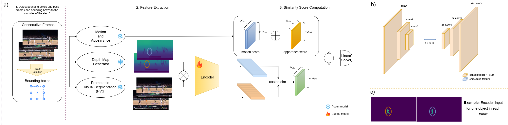

# Fast Self-Supervised depth and mask aware Association for Multi-Object Tracking

**Overview:**

---
## 🔧 Installation

### 1. YOLOX & FastReID
```bash
cd external/YOLOX/
pip install -r requirements.txt && python setup.py develop

cd ../fast_reid/
pip install -r docs/requirements.txt
```

### 2. Install SAM2
```bash
git clone https://github.com/facebookresearch/sam2.git && cd sam2
pip install -e .
```

### 3. Install DepthPro
```bash
git clone https://github.com/apple/ml-depth-pro.git && cd ml-depth-pro
pip install -e .
```

### 4. Set Environment Variables
Create a `.env` file in your project root:
```bash
touch .env
```

Add the following:
```
SAM2_PATH="/SAM2/sam2/"
SAM2_CHECKPOINT="/SAM2/sam2/checkpoints/sam2_hiera_large.pt"
MODEL_CFG="sam2_hiera_l.yaml"
DATASET_PATH="/datasets"
```

### 5. Download Pretrained Weights
Place model weights in `external/weights/`:

- [Deep-OC-SORT weights](https://drive.google.com/drive/folders/1cCOx_fadIOmeU4XRrHgQ_B5D7tEwJOPx?usp=sharing)  
- [DiffMOT weights](https://github.com/Kroery/DiffMOT/releases/tag/v1.0)

> **Note:** Do *not* untar `.pth.tar` YOLOX files.

---

## Dataset Setup

Organize datasets as:
```
datasets/
├── MOT17/
│   ├── train/ 
│   └── test/
├── dancetrack/
│   ├── train/ 
│   ├── test/ 
│   └── val/
├── sportsmot/
│   ├── train/ 
│   ├── test/ 
│   └── val/
```

Convert to COCO format:
```bash
python3 data/tools/convert_mot17_to_coco.py
python3 data/tools/convert_dance_to_coco.py
python3 data/tools/convert_sport_to_coco.py
```

---

## Depth Feature Extraction

Extract depth maps using DepthPro:

```bash
python3 train_VAE/depth_frame_apple/depth_extractor.py --split val --mode train
python3 train_VAE/depth_frame_apple/depth_extractor.py --split train --mode train
```
---

## Mask Feature Extraction

Extract segmentation masks using SAM2:

```bash
python3 train_VAE/prompt_mask/mask_bboxes.py --split val --mode train
python3 train_VAE/prompt_mask/mask_bboxes.py --split train --mode train
```

---

## VAE Training 

Train the VAE-based matching network using the extracted features:

```bash
python3 train_VAE/train_file/train_matching_network.py
```
- Input features:  
  - Depth: `train_VAE/depth_frame_apple/`  
  - Masks: `train_VAE/prompt_mask/`

- Training settings (modifiable in script):
  - Epochs: 12
  - Batch size: 64
  - Learning rate: 1e-3

- Outputs:
  - TensorBoard logs: `runs/matching_network_experiment/`
  - Model checkpoints:  
    - `train_file/runs/weights/matching_network.pth`  
    - `matching_network_final.pth`

---

## Evaluation

```bash
# SportsMOT
python3 main.py --exp_name best_paper_ablations --post --grid_off --new_kf_off --cmc_off --dataset sport --w_assoc_emb 1.75 --aw_param 1

# DanceTrack
python3 main.py --exp_name best_paper_ablations --post --grid_off --new_kf_off --cmc_off --dataset dance --aspect_ratio_thresh 1000 --w_assoc_emb 1.35 --aw_param 1

# MOT17
python3 main.py --exp_name best_paper_ablations --post --grid_off --new_kf_off --cmc_off --dataset mot17 --w_assoc_emb 1.35 --aw_param 1
```

---

## Acknowledgements

Built on top of:
- [Deep-OC-SORT](https://github.com/GerardMaggiolino/Deep-OC-SORT/tree/main)
- [OC-SORT](https://github.com/noahcao/OC_SORT)

Utilizes:
- [SAM2](https://github.com/facebookresearch/sam2)  
- [DepthPro](https://github.com/apple/ml-depth-pro)  
- [YOLOX](https://github.com/Megvii-BaseDetection/YOLOX)  
- [FastReID](https://github.com/JDAI-CV/fast-reid)  

---

## Citation

If you find this work useful, please cite:

```bibtex
@inproceedings{khanchi2025self,
  title={Fast Self-Supervised depth and mask aware Association for Multi-Object Tracking},
  author={Khanchi, Milad and Amer, Maria and Poullis, Charalambos},
  booktitle={Proceedings of the British Machine Vision Conference (BMVC)},
  year={2025},
  note={Under review}
}
